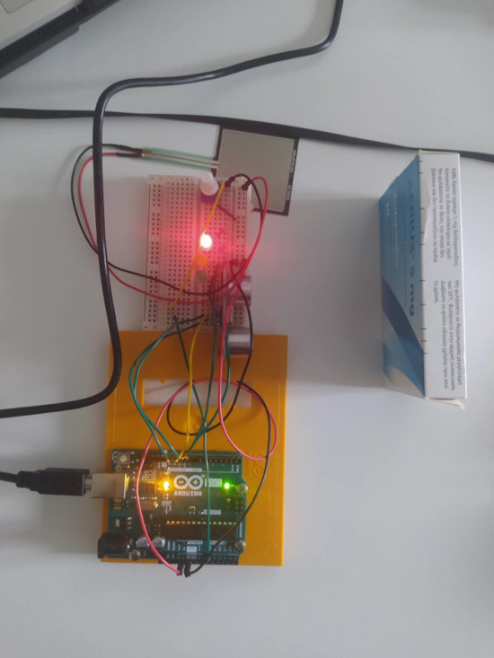
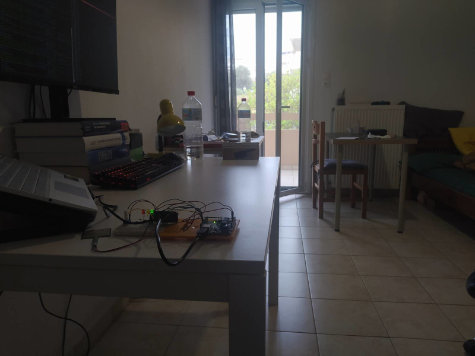
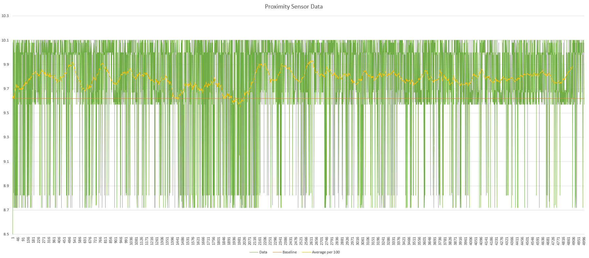
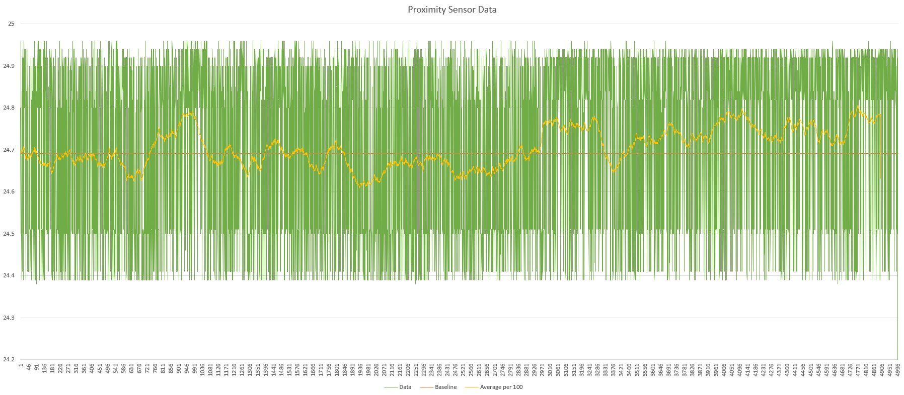
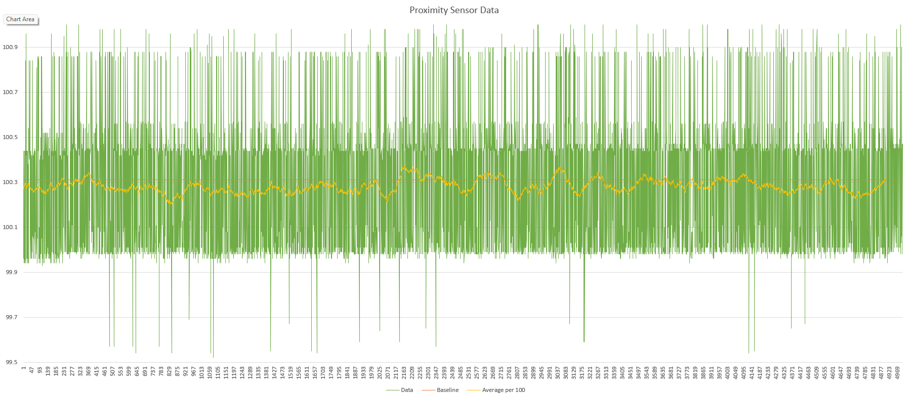
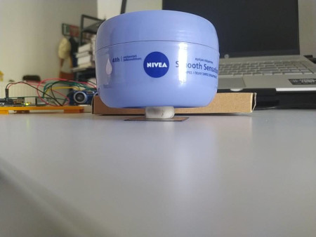

# HY - 590.31

### Lab Assignment 1

Vaggelis Gkolandas ( csdp1329 )

Hilal Özen ( csdp1320 )

Spiridon Tzagkarakis ( csd4279 )

###### Spring, 2023 [ 24/04/23 ] 

> Made using typora.

## Setup

Setup went as expected. Here are some photos from the assembly.

> Image 1: Device assembled and reading distance at reference 10cm.

> Image 2: Device assembled and reading at reference 100cm.

## Questions

1. 

> Distance was calculated using the formula : distance = ( duration * 0.034 ) / 2

To calculate the drift, we did these steps, 

- We averaged our first few measurements to find a baseline.   
- For every point in our drift plot ( Yellow line ) we calculated the average in a window of 100 data points so that we can resolve the sensor's jitter. 

So, for the first point we calculated the average of Data[0] to  Data[99], then for the second point we calculated from Data[1] to  Data[100] and so on... Our results show frequent fluctuation that go below and above the  baseline. This shows there is drift in the readings.

The graphs bellow showcase those fluctuations ( Yellow line ):

> Fig 1: Drift on 10cm

> Fig 2: Drift on 25cm

> Fig 3: Drift on 100cm

2. A

From our testing, the distances the sensor was able to **reliably** calculate the distance of an object, were:

- Minimum : 2.6 cm 
- Maximum : ~125 cm

For an object distance larger than 125 cm the readings were not reliable. The results were not accurate.

2. B

For objects that are not directly in front of it the sensor tends to either fail to recognize the object  or calculate a distance that is 10-15% greater than that of reference. 

​	3.

 Yes, but not by directly placing the bigger object on top of the force sensor. We need smaller object to act as an intermediate first, an object to press down on the pad evenly. This is somewhat shown on the image bellow. The Nivea creme container is larger that the pad. Force is not detected by the sensor if it is placed in on the pad without an intermediate object. By having an intermediate object on top of the sensor ( the eraser ) and placing the container on top of it, we can measure its weight.

> Image 3:  Container on top of intermediate object.
